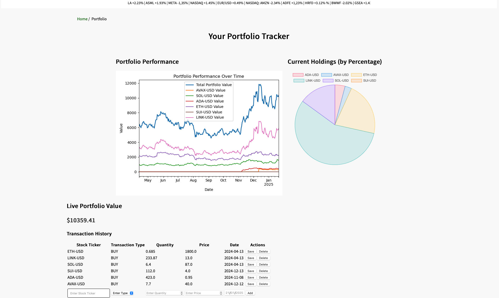

# Portfolio Tracker
The Portfolio Tracker is a financial web application that allows users to manage their stock/crypto portfolio, track historical data, and visualize performance through graphs. 

It also includes a home page with various articles on the latest financial news, and current prices of indices and significant movers.

## Installation and running application
1. **Clone the Repository**:
   ```bash
   git clone https://github.com/florinho1503/ddwt_portfolio_tracker
   cd ddwt_portfolio_tracker
2. **Set up virtual environment**:
  python3 -m venv venv
  source venv/bin/activate (for Windows: venv\Scripts\activate)
3. **Install dependencies**:
  pip install -r requirements.txt
4. **Run the app**:
  flask run

In the image below, you can see an example of a portfolio. We can add a transaction by
filling out the empty row with our new transaction data, and click add. We can also remove previous rows,
or **edit** previous rows, simply by **clicking on one of the cells** in the table, changing
its value and save the changes. 


